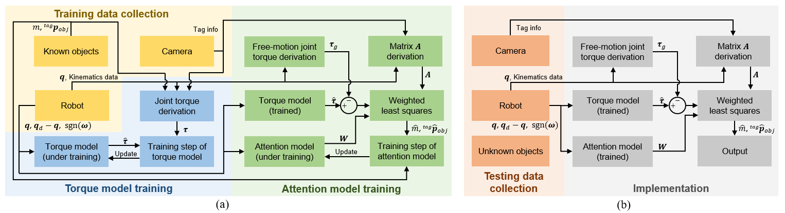

# Learning-Based Inertial Properties Estimation (lbipe)

This is the repo for paper:

> [**A Learning-Based Approach for Estimating Inertial Properties of Unknown Objects From Encoder Discrepancies**](https://ieeexplore.ieee.org/document/10176292)

published on IEEE Robotics and Automation Letters (RA-L).

## Introduction

A learning-based approach is proposed for estimating the mass and center of mass of unknown objects.
The framework requires only encoder measurements without using any force/torque sensors, but still maintains accurate estimation capability.
The block diagram is shown below:

<div align='center'>
  
</div>

(a) Training process. 
The training data are collected using known objects. 
The torque model is then trained using the derived ground truth of joint torque. 
Subsequently, the attention model is trained based on the trained torque model. 

(b) Testing process. 
The testing data are collected using unknown objects. 
The torque model is utilized to estimate the joint torque, while the attention model generates the weight matrix. 
The mass and COM of the unknown objects are solved by weighted least squares.

## Setup

All code was tested on Ubuntu 20.04 with Python 3.12 and PyTorch 2.2.1. 
You are suggested to create a virtual environment in conda, and install the dependencies.
A sample code is as follows:

```
conda create --name lbipe_env python=3.12  # create a vitual environment
conda activate lbipe_env  # activate the virual environment
conda install --file requirements.txt  # install required python packages
conda install pytorch torchvision torchaudio pytorch-cuda=11.8 -c pytorch -c nvidia  # install pytorch
conda deactivate  # exit the virtual environment
```

## Running Pretrained Models

The results in the paper are generated with ten pairs of pretrained torque models and attention models, which are available in `./dicts`. 
Please run the scripts `torque_test.py` and `attn_test.py` to evaluate the proposed approach using pretrained models.

## Training New Models

You can use the scripts `torque_train.py` and `attn_train.py` to train new models. 
The provided dataset can be found in `./data` as

- `data_train_<mass>.npz`: 11536 samples of planned configurations of each training object.
- `data_train_random_<mass>.npz`: 10000 samples of random configurations of each training object.
- `data_test_<object>.npz`: 1000 samples of random configurations of each testing object.

